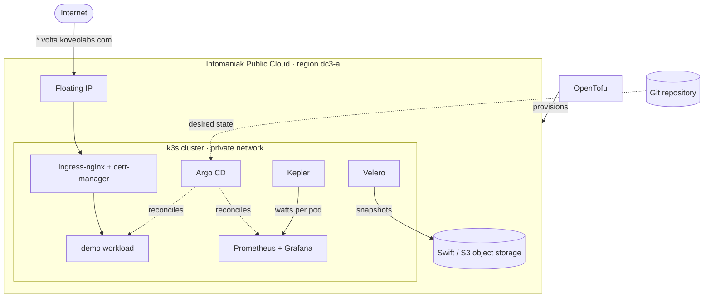

# volta

A reproducible Kubernetes platform on the Infomaniak Public Cloud (OpenStack), provisioned end
to end with OpenTofu, then instrumented to measure the energy draw and carbon footprint of the
workloads it runs.

## The problem

Cloud infrastructure hides its physical cost. A pod drawing 40 W looks exactly like a pod
drawing 4 W: same dashboard, same green checkmark, same invoice line buried in an aggregate.
Capacity ends up sized by intuition, and "we should optimise this" stays an opinion, because
the thing being optimised is never measured.

volta closes that gap on a small scale. It builds a complete platform from nothing — network,
instances, storage, cluster, GitOps, ingress, TLS, backups, observability — and then adds the
signal most platforms lack: watts and grams of CO2eq attributed per workload, shown next to
what those workloads actually cost.

Two constraints matter more than the feature list:

- **Everything is destroyed and rebuilt with a single command.** A step that cannot survive a
  full `destroy` / `apply` cycle is not finished.
- **Every measurement states its own margin of error.** Energy figures taken inside a virtual
  machine are estimates, and this repository says so wherever it reports one.

## Target architecture

This is the target, not the current state. See the status below for what actually exists.

## Status

**Phase 1 — the platform**

- [x] Repository foundations: secret-safe `.gitignore`, pre-commit guardrails
- [x] OpenStack access: project, application credentials, [resource inventory](docs/platform-inventory.md)
- [ ] Network layer: network, subnet, router, security groups, keypair
- [ ] Remote state in Swift / S3, with locking
- [ ] Compute: cluster instances, cloud-init, floating IP, Cinder volumes
- [ ] k3s bootstrap from a single `apply`
- [ ] Ingress and TLS: ingress-nginx, cert-manager, Let's Encrypt
- [ ] GitOps with Argo CD
- [ ] Observability: Prometheus and Grafana
- [ ] Backups with Velero, proven by a real restore
- [ ] One-command lifecycle and CI

**Phase 2 — energy and carbon**

- [ ] Per-pod power instrumentation scraped by Prometheus
- [ ] Carbon model: emission factor, PUE, recording rules
- [ ] Grafana dashboard: energy and cost per workload, provisioned as code
- [ ] One optimisation, measured before and after

## Technical decisions

Each significant decision is recorded as an ADR in [`docs/adr/`](docs/adr/), with the options
that were rejected and why.

| Decision | Rationale | Record |
|---|---|---|
| OpenTofu rather than Terraform | MPL-2.0 licensing, supported by Infomaniak's own documentation | [ADR 0001](docs/adr/0001-use-opentofu-instead-of-terraform.md) |
| Self-managed k3s rather than managed Kubernetes | The cluster bootstrap is part of what this repository demonstrates | [ADR 0002](docs/adr/0002-run-a-self-managed-k3s-cluster.md) |
| Application credentials rather than user passwords | Scoped, revocable, never tied to a human account | [ADR 0003](docs/adr/0003-authenticate-with-an-application-credential.md) |

## What broke, and how it was fixed

Nothing yet. This section grows as the project does, and it is deliberately placed above the
feature list: how a platform fails and recovers says more about it than what it does on a good
day.

## Known limitations

- **Energy figures are estimates.** RAPL counters are not exposed inside a virtual machine, so
  per-pod power is derived from a model rather than read from hardware. The margin of error is
  documented alongside the dashboard rather than hidden behind it.
- **DNS records are not yet part of the one-command flow.** The platform does expose Designate,
  the OpenStack DNS API, so folding the wildcard record into the same `apply` looks feasible. It
  is not proven: it depends on delegating the subdomain to Designate's nameservers, which is
  tested in the ingress step. Until then, the record pointing at the floating IP is maintained
  by hand.

## License

MIT. See [LICENSE](LICENSE).
