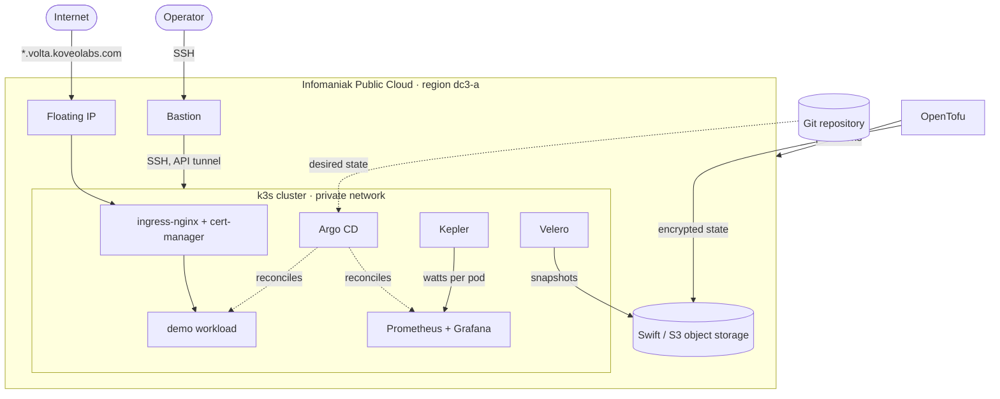

# volta

A reproducible Kubernetes platform on the Infomaniak Public Cloud (OpenStack), provisioned end
to end with OpenTofu, then instrumented to measure the energy draw and carbon footprint of the
workloads it runs.

## The problem

Cloud infrastructure hides its physical cost. A pod drawing 40 W looks exactly like a pod
drawing 4 W: same dashboard, same green checkmark, same invoice line buried in an aggregate.
Capacity ends up sized by intuition, and "we should optimise this" stays an opinion, because
the thing being optimised is never measured.

volta closes that gap on a small scale. It builds a complete platform from nothing — network,
instances, storage, cluster, GitOps, ingress, TLS, backups, observability — and then adds the
signal most platforms lack: watts and grams of CO2eq attributed per workload, shown next to
what those workloads actually cost.

Two constraints matter more than the feature list:

- **Everything is destroyed and rebuilt with a single command.** A step that cannot survive a
  full `destroy` / `apply` cycle is not finished.
- **Every measurement states its own margin of error.** Energy figures taken inside a virtual
  machine are estimates, and this repository says so wherever it reports one.

## Target architecture

```mermaid
flowchart TB
    internet([Internet])
    operator([Operator])
    git[("Git repository")]
    tofu["OpenTofu"]

    subgraph cloud["Infomaniak Public Cloud · region dc3-a"]
        fip["Floating IP"]
        bastion["Bastion"]
        swift[("Swift / S3 object storage")]

        subgraph k3s["k3s cluster · private network"]
            ingress["ingress-nginx + cert-manager"]
            app["demo workload"]
            argo["Argo CD"]
            obs["Prometheus + Grafana"]
            kepler["Kepler"]
            velero["Velero"]
        end
    end

    internet -->|"*.volta.koveolabs.com"| fip
    fip --> ingress
    operator -->|SSH| bastion
    bastion -->|"SSH, API tunnel"| k3s
    ingress --> app
    git -.->|desired state| argo
    argo -.->|reconciles| app
    argo -.->|reconciles| obs
    kepler -->|watts per pod| obs
    velero -->|snapshots| swift
    tofu -->|provisions| cloud
    tofu -->|encrypted state| swift
```

This is the target, not the current state. See the status below for what actually exists.

## Status

**Phase 1 — the platform**

- [x] Repository foundations: secret-safe `.gitignore`, pre-commit guardrails
- [x] OpenStack access: project, application credentials, [resource inventory](docs/platform-inventory.md)
- [x] Network layer: network, subnet, router, security groups, keypair
- [x] Remote state in Swift through the S3 API: encrypted, versioned, no lock
  ([why](docs/adr/0006-store-the-state-in-swift-without-a-lock.md))
- [x] Compute: three nodes in three availability zones, reached through a bastion
  ([how](docs/runbooks/node-access.md))
- [ ] k3s bootstrap from a single `apply`
- [ ] Ingress and TLS: ingress-nginx, cert-manager, Let's Encrypt
- [ ] GitOps with Argo CD
- [ ] Observability: Prometheus and Grafana
- [ ] Backups with Velero, proven by a real restore
- [ ] One-command lifecycle and CI

**Phase 2 — energy and carbon**

- [ ] Per-pod power instrumentation scraped by Prometheus
- [ ] Carbon model: emission factor, PUE, recording rules
- [ ] Grafana dashboard: energy and cost per workload, provisioned as code
- [ ] One optimisation, measured before and after

## Technical decisions

Each significant decision is recorded as an ADR in [`docs/adr/`](docs/adr/), with the options
that were rejected and why.

| Decision | Rationale | Record |
|---|---|---|
| OpenTofu rather than Terraform | MPL-2.0 licensing, supported by Infomaniak's own documentation | [ADR 0001](docs/adr/0001-use-opentofu-instead-of-terraform.md) |
| Self-managed k3s rather than managed Kubernetes | The cluster bootstrap is part of what this repository demonstrates | [ADR 0002](docs/adr/0002-run-a-self-managed-k3s-cluster.md) |
| Application credentials rather than user passwords | Scoped, revocable, never tied to a human account | [ADR 0003](docs/adr/0003-authenticate-with-an-application-credential.md) |
| Private network behind a router rather than the shared public network | Nothing is reachable from the internet until a floating IP says so | [ADR 0004](docs/adr/0004-place-nodes-on-a-private-network.md) |
| Outbound traffic denied by default | Every flow a node can open is declared, and reviewed as code | [ADR 0005](docs/adr/0005-deny-outbound-traffic-by-default.md) |
| State in Swift through the S3 API, without a lock | The platform's S3 layer refuses the conditional write a lock needs; saved plans and versioning stand in | [ADR 0006](docs/adr/0006-store-the-state-in-swift-without-a-lock.md) |
| State and plans encrypted by OpenTofu | The state holds the cluster's join token, in storage the project's credentials can read | [ADR 0007](docs/adr/0007-encrypt-the-state-and-plans.md) |
| Node image pinned by ID | Glance republishes images under the same name; a lookup by name would replace the cluster at each rebuild | [ADR 0008](docs/adr/0008-pin-the-node-image-by-id.md) |
| One etcd member per availability zone | A lost zone costs one member, not the quorum, for under a millisecond of latency | [ADR 0009](docs/adr/0009-place-one-etcd-member-per-availability-zone.md) |
| etcd on the root disk, below its latency guideline | Measured: neither the root disk nor a Ceph volume meets it, and the gap has not yet been shown to matter | [ADR 0010](docs/adr/0010-keep-etcd-on-the-root-disk.md) |
| A bastion as the only way in | No node has a public address, and the exposed machine is not a member of the cluster | [ADR 0011](docs/adr/0011-reach-the-nodes-through-a-bastion.md) |
| Join token passed in user data | The cluster forms from one apply; each server drops its pods' traffic to the metadata service, the one path to user data that needs no root | [ADR 0012](docs/adr/0012-pass-the-join-token-in-user-data.md) |
| k3s installed by cloud-init from the release's own script | `get.k3s.io` serves a script that follows the main branch; the tagged one runs as root only if its SHA-256 matches | [ADR 0013](docs/adr/0013-install-k3s-from-cloud-init.md) |

## What broke, and how it was fixed

This section grows as the project does, and it is deliberately placed above the feature list:
how a platform fails and recovers says more about it than what it does on a good day.

**A version constraint that OpenTofu never checked.** A typo in `required_version`, the
operator `=>`, which does not exist, passed `tofu validate` without a word. Testing the edge
cases showed why: OpenTofu 1.12.5, the version used here, does not enforce a `required_version`
written in a `.tf` file. Even `">= 99.0.0"`, or plain garbage, passes `init` and `plan` there,
while the same constraint in a `.tofu` file stops the run with `Incompatible module`. The
[documentation](https://opentofu.org/docs/language/settings/) now describes that setting as
kept for compatibility with Terraform, and adds a `language` block for OpenTofu's own
constraints. The configuration in [`infra/`](infra/) uses the `.tofu` extension, so its version
constraint is enforced.

**A CLI that showed the cluster's internal ports open to the internet.** After the first
`apply`, `openstack security group rule list`, and `rule show` as well, printed `0.0.0.0/0` as
the remote side of the six rules scoped to the security group itself: etcd, kubelet, the
Kubernetes API, Flannel, ICMP and node-to-node egress. Neutron refuses a rule that sets both a
remote prefix and a remote group, so the display could not be literal. The raw API response
(`GET /v2.0/security-group-rules`) carries `remote_ip_prefix: null` for those rules, and the
OpenTofu state agrees: nothing was exposed. The client, python-openstackclient 10.3.0, fills
the empty field for display. Security group rules are now verified against the API response,
not against the client's table.

**A state lock the platform cannot take.** With `use_lockfile = true`, `tofu plan` failed
before doing anything. OpenTofu takes that lock by writing an object with `If-None-Match: *`,
and Swift 2.30.1, which serves the S3 API here, answers every conditional write with `501
NotImplemented`: "Conditional object PUTs are not supported." The header is checked before the
signature, so the same answer comes back for a key that does not exist, which made it possible
to confirm without any credential. Upstream Swift accepts the header from 2.36.0. Until the
platform runs it, the state has no lock, and
[ADR 0006](docs/adr/0006-store-the-state-in-swift-without-a-lock.md) says what stands in.

**An S3 key the automation was not allowed to create.** `openstack ec2 credentials create`,
run with the application credential, was refused: "Using method 'application_credential' is
not allowed for managing additional application credentials." The message matches a check
Keystone added to S3 key creation in April 2026 (bug 2142138), because a restricted credential
could otherwise create a key with all of its owner's rights. The key was created once with the
account password.

**A migration that restarted the state's history.** After `tofu init -migrate-state`, the state
in Swift was at serial 1 with a new lineage, where the local one had been at serial 10. Every
resource was there: 21 entries, and an empty plan. On the first write to an empty backend,
OpenTofu 1.12.5 re-reads the destination, finds nothing, and resets the lineage and serial it
had just copied (`PersistState`, `internal/states/remote/state.go`). No harm done, but it is
worth knowing before comparing an old copy of the state with the live one.

**An argument the provider's schema advertised, and refused.** The nodes pin their image by ID,
because Glance republishes its images under the same name: the Ubuntu 24.04 build of 14
September was replaced on 28 September, and looking it up by name would have replaced the whole
cluster at the next plan. Checking that ID failed first. The provider schema lists `id` as an
optional argument of the `openstack_images_image_v2` data source, and `tofu validate` rejected
it as an "Invalid or unknown key": that `id` is the field the plugin SDK adds to every data
source, 53 of the 54 here. The pinned ID is now checked against the builds carrying the expected
name, visible and hidden, which another data source can list.

## Known limitations

- **Energy figures are estimates.** RAPL counters are not exposed inside a virtual machine, so
  per-pod power is derived from a model rather than read from hardware. The margin of error is
  documented alongside the dashboard rather than hidden behind it.
- **DNS records are not yet part of the one-command flow.** The platform does expose Designate,
  the OpenStack DNS API, so folding the wildcard record into the same `apply` looks feasible. It
  is not proven: it depends on delegating the subdomain to Designate's nameservers, which is
  tested in the ingress step. Until then, the record pointing at the floating IP is maintained
  by hand.
- **Administration has a single door.** The bastion is the only way to the nodes. If it fails, the
  cluster keeps running but cannot be administered until an apply recreates it.
- **etcd's disk is slower than etcd asks for.** Measured `fdatasync` latency at the 99th
  percentile is 10 to 24 ms on the nodes' root disks, against a guideline of 10 ms; see
  [ADR 0010](docs/adr/0010-keep-etcd-on-the-root-disk.md).
- **User data is readable from inside every instance**, from a config drive the platform always
  attaches and from the metadata service, and the servers' user data carries the cluster's join
  token. Root on a server can read the token anyway; each server drops its pods' traffic to the
  metadata service. See [ADR 0012](docs/adr/0012-pass-the-join-token-in-user-data.md).
- **Every k3s setting is fixed when a server is created.** It lives in the user data, so changing
  the version or any option replaces the three servers, and the cluster with them. That holds
  while nothing lives only in the cluster; see
  [ADR 0013](docs/adr/0013-install-k3s-from-cloud-init.md).
- **The metered cost is incomplete.** For nine hours, CloudKitty rated only the reserved part of
  one running node, never its running part. Cost figures taken from it are a lower bound, and
  say so; see the [inventory](docs/platform-inventory.md#cost).
- **The state has no lock.** One operator, saved plans and a versioned container stand in for
  it. That holds for a lab run by one person, and not beyond; see
  [ADR 0006](docs/adr/0006-store-the-state-in-swift-without-a-lock.md) and the
  [remote state runbook](docs/runbooks/remote-state.md).

## License

MIT. See [LICENSE](LICENSE).
